Week 1 Report: Linux Essentials, Python Basics, and Git

Day 1-2 : Basic Navigation and File Operations

Commands Practiced:
**Command**: pwd
The pwd (print working directory) command displays the full path of the directory you are currently in. 

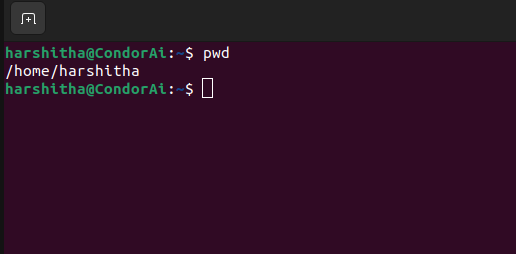

This indicates that you are in the /home/harshitha directory.

Listing Files:

**Command**: ls
The ls command lists all files and directories in the current directory, excluding hidden files (those starting with a dot).

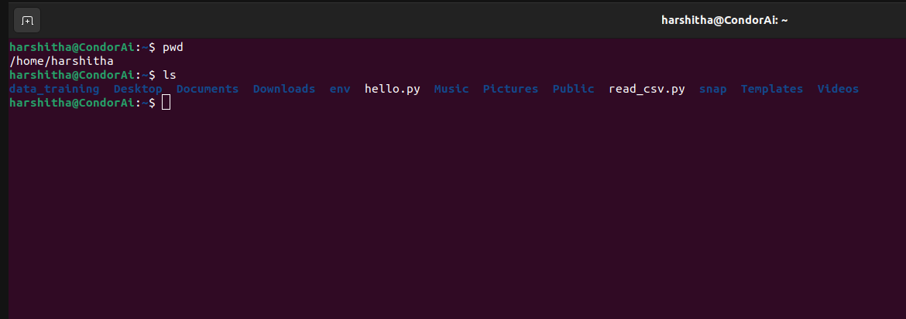

Creating Directories and Files:
**Command**: mkdir <folder_name>
Creates a new directory.

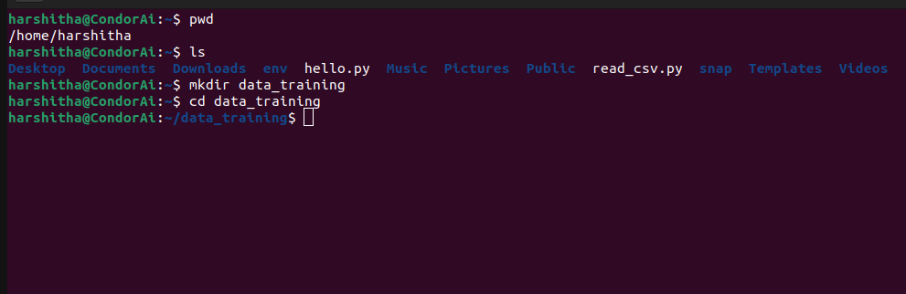

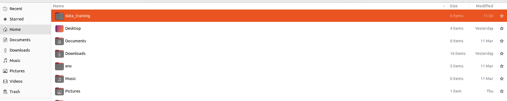

**Command**: cd <folder_name>
Changes into the specified directory.

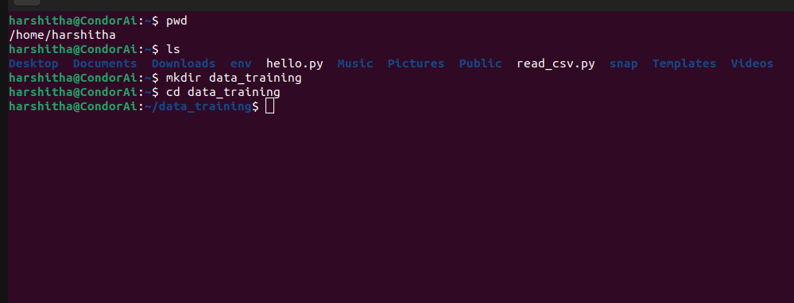

Creating Empty File:

**Command**: touch <file_name>
Creates an empty file in the current directory.

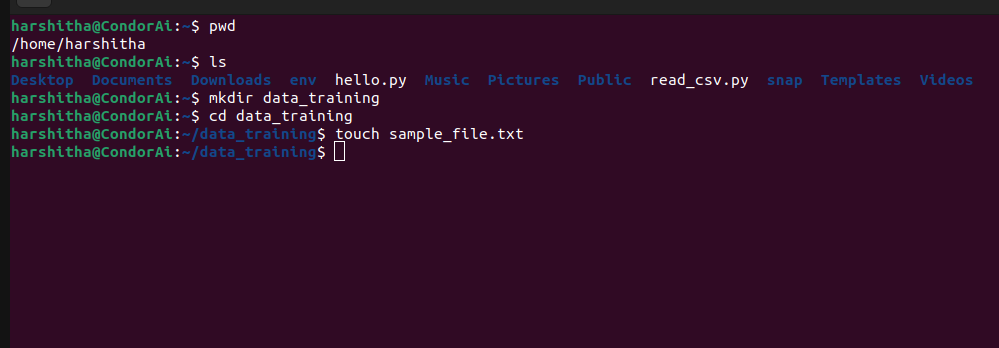

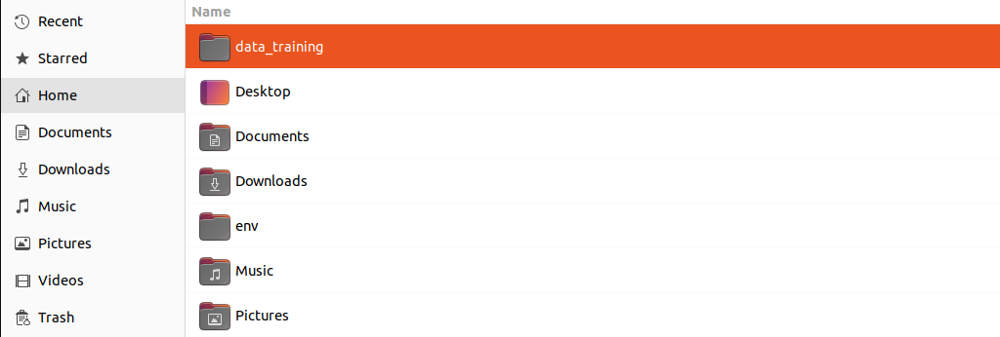

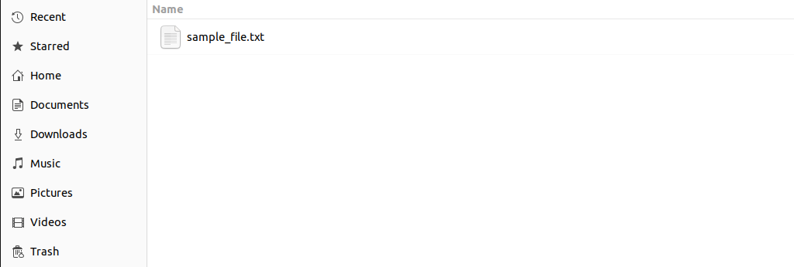

Listing Files:

**Command**: ls -la
Lists files with detailed information such as file permissions, owner, and size.

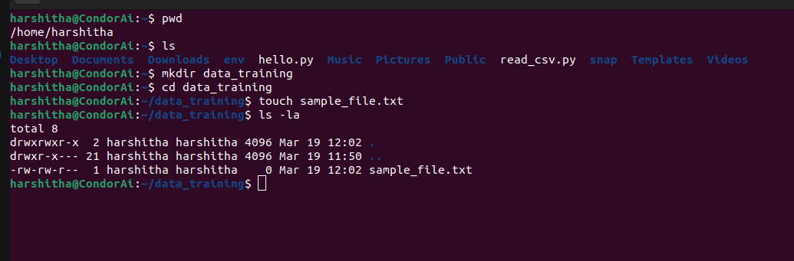

Changing File Permissions:
**Command**: chmod <permissions> <file_name>
Changes the permissions of a file.

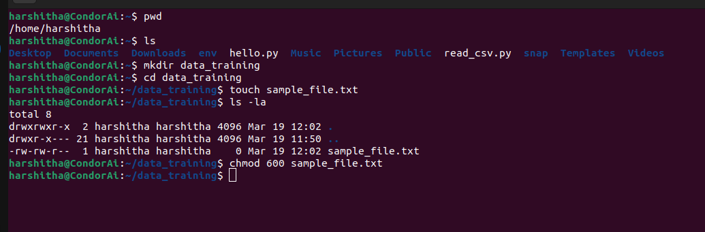

**Command**:ls -l<file_name>
To Check permissions of a file.

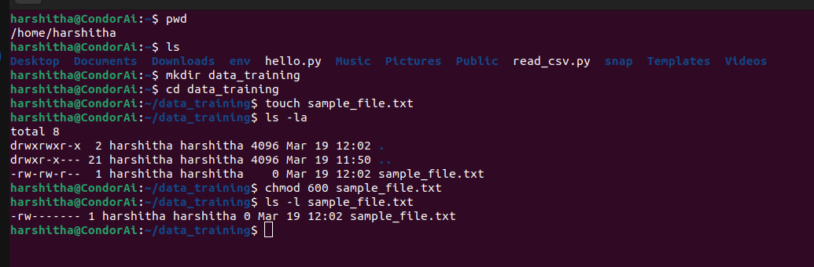
I used a text editor (VS Code) to write a short note explaining what each command does. I saved this as linux_commands.md in the data_training folder.

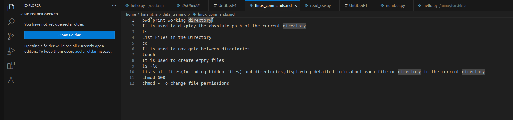

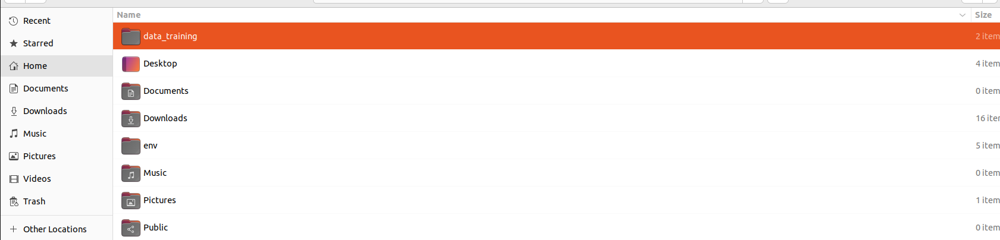

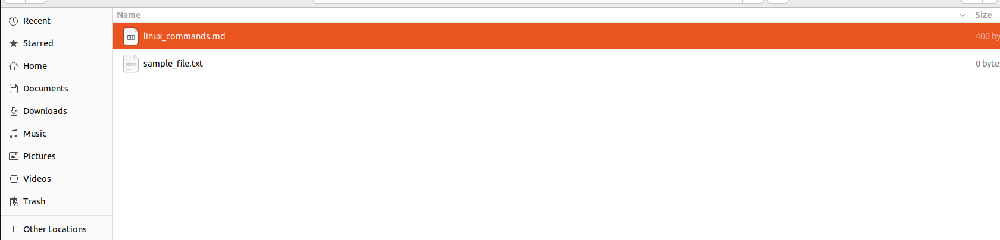

Day 3–4: Python Fundamentals & CSV Ingestion

Python Setup

**Command**:python3 –version
Checking Python Version:I checked the version of Python installed on my system to make sure it's Python 3.x.

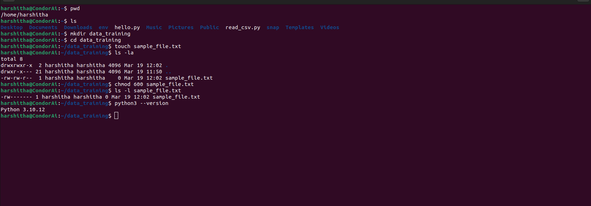

Creating a Virtual Environment:
**Command**:python3 -m venv env

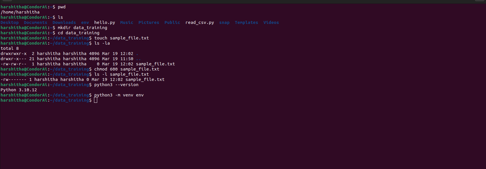

To Activate the virtual environment:
**Command**:source env/bin/activate 

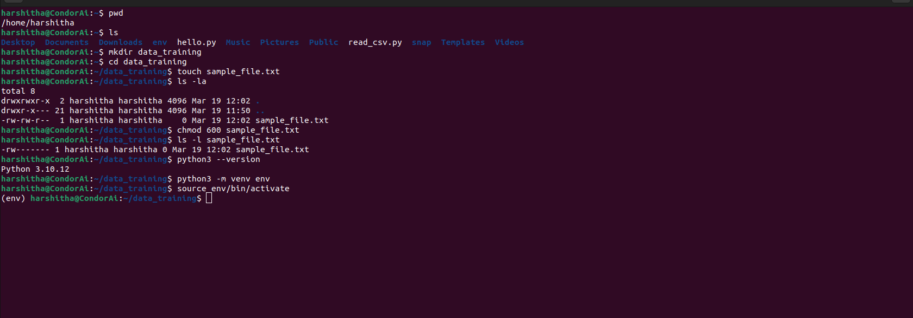

"Hello, World!" Script:
Create a file named hello.py.

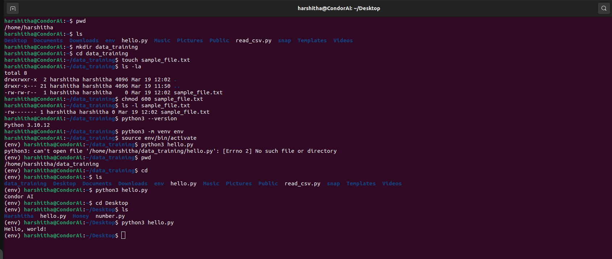

Run it using
**Command**:python3 hello.py

CSV Reader Script:
sample_data.csv

Name,Age,City 
Alice,30,New York 
Bob,25,Los Angeles 
Charlie,35,Chicago

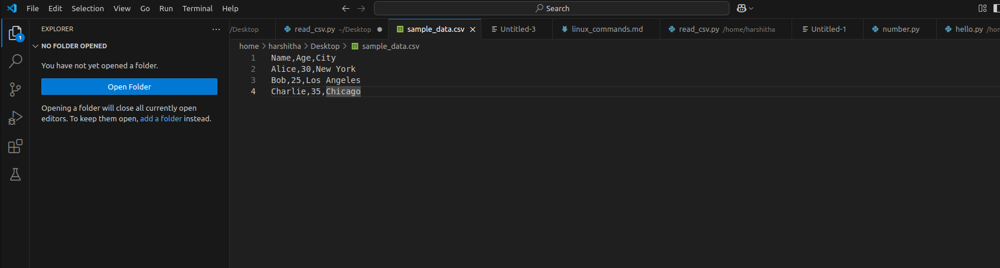

read_csv.py

Code Sample:
# read_csv.py
import csv 

def read_csv(file_path): 
try: 
with open(file_path, mode='r', newline='') as csvfile: 
reader = csv.reader(csvfile) 
# Read header 
header = next(reader) 
print("Header:", header) 
# Iterate over rows 
row_count = 0 
for row in reader: 
print("Row:", row) 
row_count += 1 
print(f"Total rows (excluding header): {row_count}") 
except FileNotFoundError: 
print(f"Error: File not found - {file_path}") 
except Exception as e: 
print("Error while reading CSV:", str(e)) 

if __name__ == "__main__": 
read_csv("sample_data.csv")

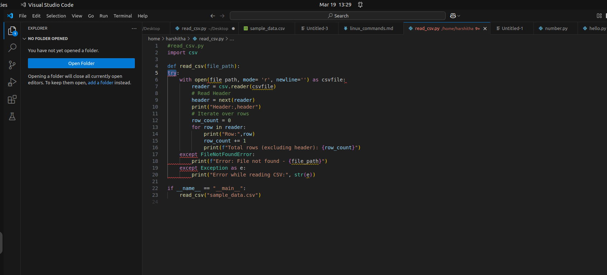

Day 5: Introduction to Git

Git Installation and Configuration:
**Command**:sudo apt-get install git

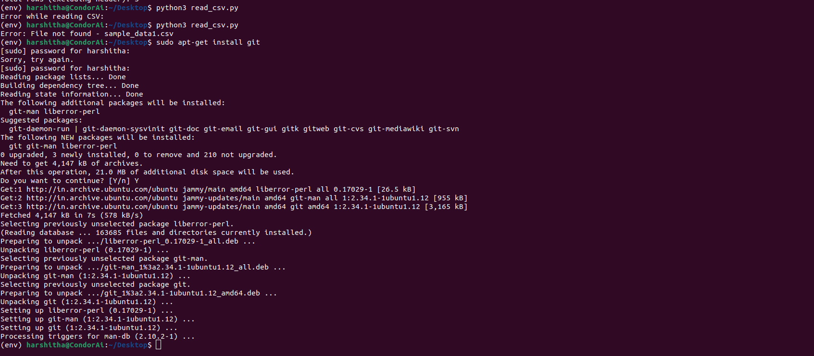

**Command**:git config --global user.name "Your Name"
**Command**:git config --global user.email "your.email@example.com"

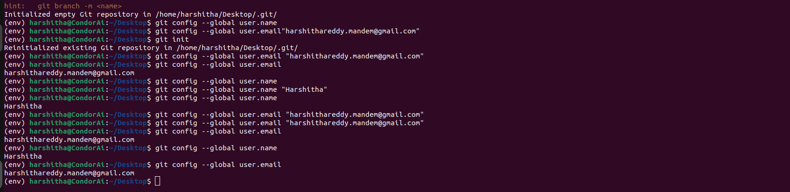

Repository Initialization and Commit:
In data_training folder,

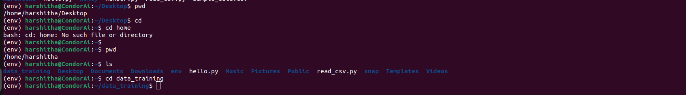

Initializing  a new Git repository
**Command**:git init
**Command**:git add hello.py read_csv.py

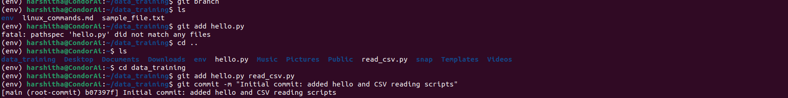

**Command**:git commit -m "Initial commit: added hello and CSV reading scripts"

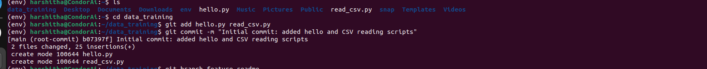

Branching and Merging:
To Create a new branch named 'feature-readme'
**Command**:git branch feature-readme

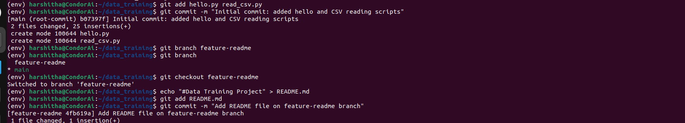

To Switch to the new branch 
**Command**:git checkout feature-readme

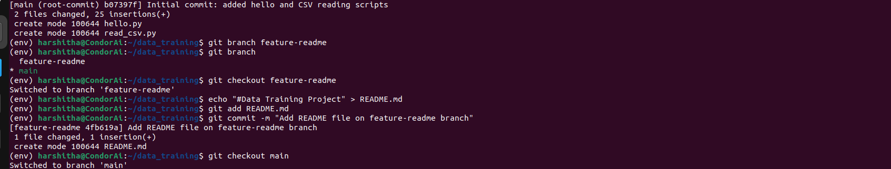

In order to Create a README file
**Command**:echo "# Data Training Project" > README.md
**Command**:git add README.md
**Command**:git commit -m "Add README file on feature-readme branch"

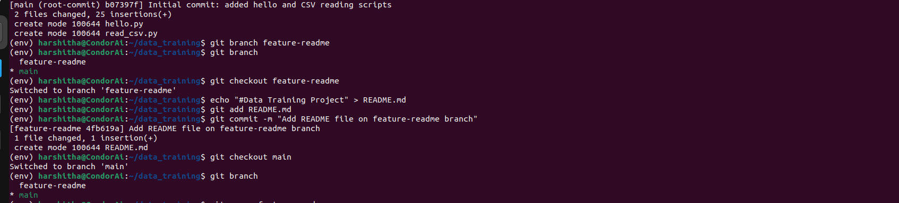

To Switch back to main branch and merge changes
**Command**:git checkout main
**Command**:git merge feature-readme

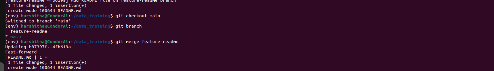

**Command**:git log –oneline

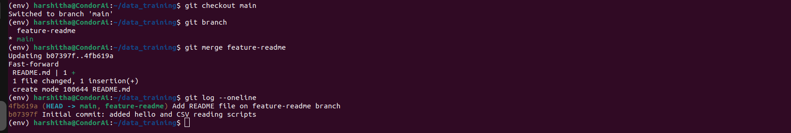

