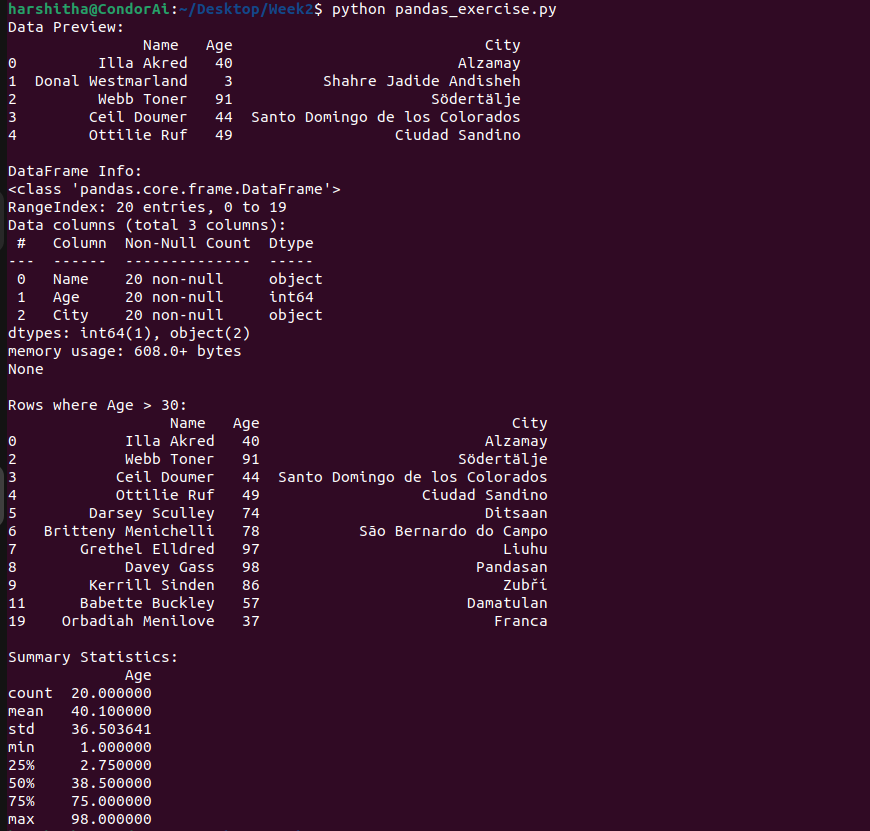

Step-1: Installed pandas library for data manipualtion.

Step-2: Load the sample_data.csv file into the DataFrame

DataFrame: DataFrame is a data structure allows us to store the data in tabular format 

Step-3: For Data Preview, we have used df.head() command which will fetch first few rows of the DataFrame. By default, it shows the first five rows.

Step-4: For DataFrame Info, we have used df.info() command which will give the summary of the DataFrame like number of entries, columns, column names, data types etc.

Step-5: For Rows where Age > 30, we have used df[df["Age"] > 30] condition where it accesses the Age column of the DataFrame and it  df[“Age”] > 30 will return the boolean values and df[df[“Age”]] will filter the values which satisfies our condition.

Step-6: For Summary Statistics, we have used df.describe(), which will generate summary statistics of the numerical columns of the DataFrame like count, min, mean etc.

