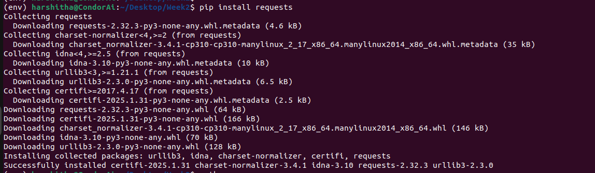

API stands for Applicaiton Programming Interface. It's a set of protocols that allows one software application to interact with another. There are few standard methods used for communication like GET,POST,PUT,DELETE.

An API request is made by sending a message to the API's endpoint using HTTP methods and after receiving the request, the API sends a response. This response contains the requested data (in formats like JSON or XML).

Here, we have written a python script to make a GET request to an API using the Requests library, handle errors, and process the data returned by the API. We have installed requests library below so that we can methods like GET,POST,PUT,DELETE and also supports JSON format.

After installing the library, we have create fetch_data(api_url), this function is to make a GET request to api_url and get the data. We have used requests.get(api_url, timeout=10) to send a GET request to api_url with the timeout of 10 seconds to ensure that the request is timed out after 10 seconds if there is no response.

Also, we have used raise_for_status() for error handling. I have used wrong url below due to which we recieved an error as shown below.

Now, correct url has been used due to which it fetched the data from the API

