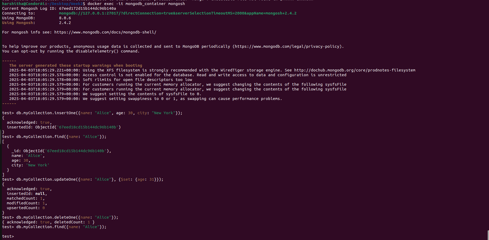

I have installed MongoDB locally and entered into MongoDB shell to perform CRUD operations.

Create Operation: Create or insert operations add new documents to a collection. If the collection does not currently exist, insert operations will create the collection. Below command has been used to insert the record into the collection

db.myCollection.insertOne({name: "Alice", age: 30, city: "New York"})

Read Operation: Read operations retrieve documents from a collection. Below command has been used to retrieve the data with the name: “Alice”

db.myCollection.find({name: "Alice"});

Update Operation: Update operations modify existing documents in a collection. Below command has been used to update age from 30 to 31.

db.myCollection.updateOne({name: "Alice"}, {$set: {age: 31}});

Delete Operation: Delete Operation removes the existing documents in a collection. Below command has been used to remove the records with the name: “Alice”

db.myCollection.deleteOne({name: "Alice"});

