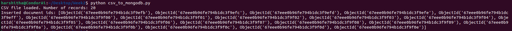

Here we are trying to read the data from csv file and inset that document into mongodb. To achieve that, we have imported pandas and pymongo libraries.

In this scipt, we have used pd.read_csv(csv_file) which will read the csv file into pandas DataFrame. Next we will make a connection to MongoDB. Post that we will use df.to_dict(orient="records") which will convert rows of DataFrames into dictionaries where each dictionary represents one record in the csv file. Next we will use collection.insert_many(records) which will insert the dictionaries to MongoDB collection.

Observation: I have encountered below error while trying to run the script. The error below indicates that there is an issue with the indentation

