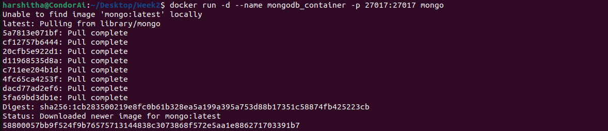
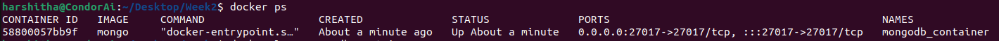
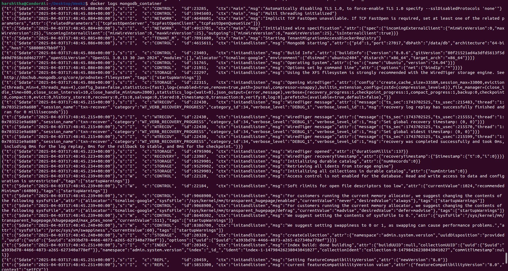
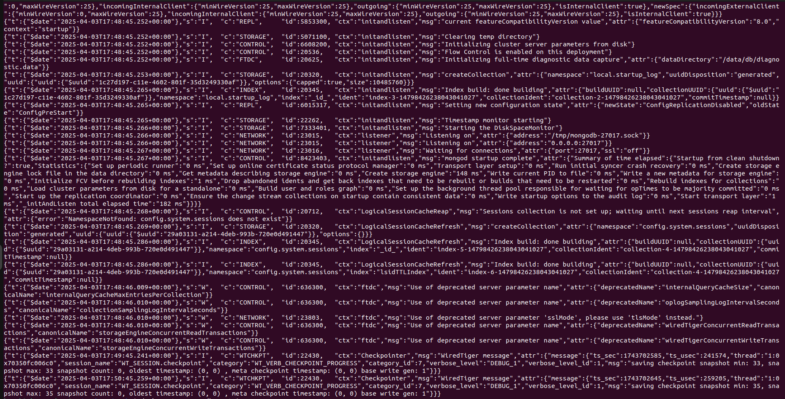

This command runs MongoDB in a Docker container named mongodb_container, accessible via port 27017 on your local machine. The -d flag ensures it runs in the background.

This command lists all the containers that are currently running on your system. By default, it only shows running containers.

This command shows the logs generated by a running or stopped container. It’s useful to check if the container is functioning correctly or if there are any errors.

This command stops a running Docker container.

